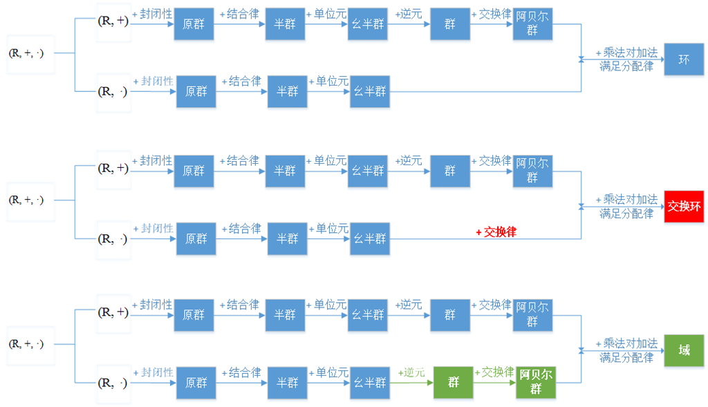

# Chapter 2

## 2.1 信息存储

1. 1byte=8bits, 最小可寻址储存单位。

2. 字长(word size), 指明整数和指针数据标称大小(normal size)。例如通常所说的8086是16位机器，80386是32位机器，就是它们字长分别为16位和32位。

3. 小端规则(little endian): 数据储存时，最低有效字节储存在最低地址。  
   大段规则(big endian): 数据储存时，最高有效字节储存在最低地址。
    >示例代码：[show_bytes.c](./show_bytes.c)

4. 布尔代数(bool algebra): <{1,0}, |, &, ~, 0, 1>  
    布尔代数不是一个环，其加法不以~为逆元运算。但若以异或^和同一I分别替换|和~, 则其构成了一个环。

   布尔环(bool ring): <{1,0}, ^, &, I, 0, 1>  
    可运用性质: a^a=0, a^0=a
    >交换两个元素: [swap.c](./swap.c)

    环的定义见下图.
    

5. 布尔代数运算：  
    - &: 用于置位为0 
        a & 1 = a, a & 0 = 0
    - |: 用于置位为1 
        a | 1 = 1, a | 0 = a
    - ^: 用于反转位(补位)
        a ^ 1 = ~a, a ^ 0 = a
    - 用&, |, ~实现^:  
        x ^ y = (x & ~y) | (y & ~x) 

6. 移位运算：
    - 逻辑移位(logical shift): 补0
    - 算术移位(arithmetic shift): 高位补高位，低位补0

---
**exercise1**
### 2-1 
A. 0x25B9D2  
    -> 0010 0101 1011 1001 1101 0010

B. 101011100100100  
    -> 0xAE49
    
C. 0xA8B3D  
    -> 1010 1000 1011 0011 1101

D. 1100100010110110010110  
    -> 0x322D96

### 2-2
|   n   | $2^n$(decimal)|$2^n$(hexadecimal)|
|-------|------|------|
| 5 | 32 | 0x20|
| 23 | 8388608 | 0x800000|
| 15 | 32768 | 0x8000 |
| 13 | 8190 | 0x2000|
| 6 | 64 | 0x40 |
| 8 | 256 | 0x100 |

### 2-3
| Decimal | Binary | Hexadecimal |
|-|-|-|
| 0 | 0000 0000 | 0x00 |
| 158 | 1001 1110 | 0x9E |
| 76 | 0100 1100 | 0x4C |
| 145 | 1001 0001 | 0x91 |
| 174 | 1010 1110 | 0xAE |
| 60 | 0011 1100 | 0x3C |
| 241 | 1111 0001 | 0xF1 |

### 2-4
A. 0x6061  

B. 0x603c

C. 0x607c

D. 0x9e

### 2-5  
A. le: 78     be: 12

B. le: 7856   be: 1234

C. le: 785634 be: 123456 

### 2-6  
A.  
    0x0027C8F8:            1001111100100011111000  
    0x4A1F23E0: 1001010000111110010001111100000

B. 21 bits match.

C. int最高位, float前后数位

### 2-7  
0x6d6e6f707172

### 2-8  
| Operation | Result |
|-----------|--------|
| a | [01001110] |
| b | [11100001] |
| ~a | [10110001] |
| ~b | [00011110] |
| a&b | [01000000] |
| a|b | [11101111] |
| a^b | [10101111] |

### 2-9  
A.  
    ~black=write
    ~blue=yellow
    ~green=magenta(红紫色)
    ~cyan(蓝绿色)=red

B.  
    Blue | Green = Cyan  
    Yellow & Cyan = Green  
    Red ^ Magenta = Yellow

### 2-10  
| step | *x | *y |
|------|----|----|
| Initially | a | b |
| step1 | a | a^b |
| step2 | b | a^b |
| step3 | b | a |

### 2-11  
A. first=last=k  
B. a^a=0  
C. 终止条件改为: first< last. [swap.c](./swap.c)

### 2-12  
A. x & 0xff  
B. x ^ 0xffffff00  
C. x | 0xff

### 2-13
1. bis(x, y)
2. bis(bic(x, y), bic(y, x))  
    - 分析：先通过bic(x, y)将x中对应y位为1的位设置为0, 其中包括x, y同时为1的位和x为0, y为1的位；
    同理，通过bic(y, x)将y中对应x位为1的位设置为0, 包括x, y同时为1的位和x为1, y为0的位。
    最后通过一次或运算得到异或结果  
    -   bis() -> |  
        bic() -> & ~  
    由上述分析：x ^ y = (x & ~y) | (y & ~x)


### 2-14  
0x55: 0101 0101
0x46: 0100 0110

| Expression | Value | Experssion | Value |
|------------|-------|------------|-------|
| a & b | 0x44 | a && b | 0x01 |
| a | b | 0x57 | a || b | 0x01 |
| ~a \| ~b | 0xBB | !a \|\| !b | 0x00 |
| a & !b | 0x00 | a && ~b | 0x01 |

### 2-15  
!(x^y)

### 2-16  
| a | a<<3 | a>>2(logical) | a>>3(arithmetic) |
|---|------|---------------|------------------|
| 0xD4 | 
| 1101 0100 |
| 0x64 |
| 
| 0x72 |
|
| 0x44 |
|
---

## 2.2 整数表示

1. 无符号整数  
$[x_{w-1}x_{w-2}...x_1x_0]$
$$
B2U_w(\vec{x})=\sum_{i=0}^{w-1}x_i2^i
$$

- 值域：  
[0...00] ~ [1...11]  
0 ~ $2^w-1$

2. 有符号整数补码表示(two's complement)  
$[x_{w-1}x_{w-2}...x_1x_0]$
$$
B2T_w(\vec{x})=-x_{w-1}2^{w-1}+\sum_{i=0}^{w-2}x_i2^i
$$

- 值域：  
[100...000] ~ [011...111]  
$-2^{w-1}$ ~ $2^{w-1}-1$
- 注：  
    - 补码(two's complement)表示：负数的绝对值等于其反码加一。
    - 反码(one's complement)表示：负数的绝对值等于其反码。

3. 无符号与有符号整数之间的转换$T2U$
$$
T2U_w(x)=
\left\{
    \begin{array}{}
    x+2^w , & x<0 \\
    x , & x\ge0
    \end{array}
\right.
$$

4. 零扩充和符号扩充
- 符号数：符号扩充
$$
[x_{w-1}x_{w-2}x_{w-3}...x_2x_1x_0] ->[x_{w-1}x_{w-1}x_{w-1}...x_{w-1}x_{w-2}x_{w-3}...x_2x_1x_0]
$$
- 无符号数：符号扩充
$$
[x_{w-1}x_{w-2}x_{w-3}...x_2x_1x_0] ->[000...0x_{w-1}x_{w-2}x_{w-3}...x_2x_1x_0]
$$

---
	short val=-12345;
	unsigned uval=val;

	printf("%u ", uval);
	show_bytes((byte_pointer)&uval, sizeof uval);
    //output: 4294954951 0xc7cfffff
> C语言中，变量之间的扩充规则由赋值变量自身类型决定，与待赋值变量无关.
---

5. 截断数字
$$
B2U_k(\vec{x})=B2U_w(\vec{x}) mod 2^k \\
B2T_k{\vec{x}}=U2T_k(B2U_k\vec{x})
$$

---
**exercise2**

### 2-17
| $\vec{x}$ | | | |
|-----------|-|-|-|
| Hex | Bin | $B2U_4(\vec{x})$ | $B2T_4(\vec{x})$ |  
| 0xA | [1010] | $2^3+2^1=10$ | $-2^3+2^1=-6$ |
| 0x1 | [0001] | $2^0=1$ | $2^0=1$ |
| 0xB | [1011] | $2^3+2^1+2^0=11$ | $-2^3+2^1+2^0=-5$ |
| 0x2 | [0010] | $2^1=2$ | $2^1=2$ |
| 0x7 | [0111] | $2^2+2^1+2^0=7$ | $2^2+2^1+2^0=7$ |
| 0xC | [1100] | $2^3+2^2=12$ | $-2^3+2^2=-4$ |

### 2-18
A. 0x2e0 -> 0000 0010 1110 0000 -> 736  
B. 0x58 -> 0101 1000 -> 88  
C. 0x28 -> 0010 1000 -> 40  
D. 0x30 -> 0011 0000 -> 48  
E. 0x78 -> 0111 1000 -> 120  
F. 0x88 -> 1000 1000 -> -120  
G. 0x1f8 -> 0000 0001 1111 1000 -> 504   
H. 0xc0 -> 1100 0000 -> -64  
I. 0x48 -> 0100 1000 -> 72  

>注：负数和答案不同，第三章回来看

### 2.19
| x | $T2U_4(x)$ |
|---|------------|
| -1 | f |
| -5 | b |
| -6 | a |
| -4 | c |
| 1 | 1 |
| 8 | 8 |

### 2.21
| expression | type | evaluation |
|------------|------|------------|
| -2147483647-1 == 2147483648U | U | 1 |
| -2147483647-1 < 2147483647 | T | 1 |
| -2147483647-1U < 2147483647 | U | 0 |
| -2147483647-1 < -2147483647 | T | 1 |
| -2147483647-1U < -2147483647 | U | 1 |

### 2.22 easy

### 2.23
A.  
| w | fun1(w) | fun2(w) |
|---|---------|---------|
| 0x00000076 | 0x00000076 | 0x00000076 |
| 0x87654321 | 0x00000021 | 0x00000021 |
| 0x000000c9 | 0x000000c9 | 0xffffffc9 |
| 0xedcba987 | 0x00000087 | 0xffffff87 |

B.  
$$
fun1(x)=x\%256 \\
fun2(x)=
\left\{
    \begin{array}{}
    x\%256, & x\%256<128 \\
    x\%256-256, & x\%256\ge128 \\
    \end{array}
\right.
$$
 由上式可见:  两函数起到截断效果
 - fun1(x)等价于(unsigned char)x
 - fun1(x)等价于(char)x

### 2.24
unsigned 
| original | truncated |
|----------|----------|
| 1 | 1 |
| 3 | 3 |
| 5 | 5 |
| c | 4 | 
| e | 6 |

two's complement
| original | truncated |
|----------|----------|
| 1 | 1 |
| 3 | 3 |
| 5 | 5 |
| -4 | 4 | 
| -2 | 6 |

### 2.25
bug:  
1. 0-1=Umax
2. i: 自动类型转换int->unsigned

### 2.26
A. strlen(s)<strlen(t)  
B. overflow  
C.  
    return (int)(strlen(s)-strlen(t)) >0  
    return strlen(s)>strlen(t)

---

## 2.3 整数运算

1. 无符号加法
$x+_w^ty==(x+y)mod2^w$  
注：整数模数运算组成一个阿贝尔群
$$
x+_w^uy=
\left\{
    \begin{array}{}
    x+y, & x+y<2^w \\
    x+y-2^w, & x+y>=2^w
    \end{array}
\right. \\ 

0\le x+y\le2^{w+1}-2
$$

- 逆元：  
$$
-_w^ux=
\left\{
    \begin{array}{}
    0 , & x=0 \\
    2^w-x, & x\ne0
    \end{array}
\right.
$$
- 判断是否发生溢出:  $s\doteq x+_w^uy$  
    s>x或s>y: 未溢出  
    s<x或s<y: 溢出

2. 二进制补码加法
$$
x+_w^ty=
\left\{
    \begin{array}{}
    x+y-2^w, & x+y\ge 2^{w-1} \\
    x+y , & -2{w-1}\le x+y < 2^{w-1} \\
    x+y+2^w, & x+y< -2^{w-1}
    \end{array}
\right. \\ 

-2^w\le x+y\le 2^w-2
$$

- 逆元：  
$$
-_w^tx=
\left\{
    \begin{array}{}
    x , & x=Tmin \\
    -x, & x\ne Tmin
    \end{array}
\right.
$$
- 判断是否发生溢出:  $s\doteq x+_w^ty$  
    溢出：
    - x<0 && y<0 && s>0
    - x>0 && y>0 && s<0

3. 无符号乘法  
- 乘法模n运算：$x*_w^uy=(x\cdot y)mod2^w$  
- 无符号运算构成一个环：  
$<{0,1,2,...,2^w-1}, +_w^u, *_w^u, -_w^u, {0,1}>$

4. 二进制补码乘法  
- $x*_w^ty=U2T_w((x\cdot y)mod2^w)$
- 二进制补码运算构成一个环：  
$<{-2^w,...,2^w-1}, +_w^t, *_w^t, -_w^t, {0,1}>$

5. 常数乘法  
- 乘以2的幂  
    x*pwr2k=x<<k
- 乘以常数$ x * c, c=\sum2^{i}$  
思想：将乘法转化为有限次+, -, <<

6. 除以2的幂  
`x/pwr2k=(x<0 ? (x+(1<<k)-1): x) >> k`  
注：$\lceil x/y \rceil=\lfloor (x+(y-1))/y \rfloor$


---
**exercise3**

### 2.27
```C
//my answer
int uadd_ok(unsignd x, unsigned y)
{
    long x1=(long)x;
    long y1=(long)y; 
    x1+=y1;
    return !(x1>>32)
}

//reference
int uadd_ok(unsignd x, unsigned y)
{
    return x+y > x;
}
```

### 2.28
| x(hex) | dec | $_w^ux$(hex) | dec |
| 1 | 1 | f | 15 |
| 4 | 4 | c | 12 |
| 7 | 7 | 9 | 9 |
| a | 10 | 6 | 6 |
| e | 14 | 2 | 2 |

### 2.29
| x | y | x+y | $x+_5^ty$ | case |
|---|---|-----|-----------|------|
| [10100] | [10001] | [100101] | [00101] | 1 |
| -12 | -15 | -27 | 5 | 1 |
| [11000] | [11000] | [110000] | [10000] | 1 |
| -8 | -8 | -16 | -16 | 2 |
| [10111] | [01000] | [11111] | [11111] | 2 |
| -9 | 8 | -1 | -1 | 2 |
| [00010] | [00101] | [00111] | [00111] | 3 |
| 2 | 5 | 7 | 7 | 3 |
| [01100] | [00100] | [10000] | [10000] | 4 |
| 12 | 4 | 16 | -16 | 4 |

### 2.30
```C
int tadd_ok(int x, int y)
{
    int sum=x+y;
    return (x<0 && y<0 && sum>0) && (x>0 && y>0 && sum<0);
}
```

### 2.31 
$(x+y) mod 2^w$是一个阿贝尔群

### 2.32
```C
int tsub_ok(int x, int y)
{
    //still buggy
    return tadd_ok(x, ~y+1);
}
```
-Tmin=Tmin

### 2.33
| x | $-_w^tx$ |
|---|----------|
| 2 2 | -2 e | 
| 3 3 | -3 d |
| 9 -7 | 7 7 |
| b -5 | 5 5 |
| c -4 | 4 4 |

### 2.34
| mode | x | y | x *y | truncated x*y |
|------|---|---|------|---------------|
| unsigned | 4 | [100] | 5 | [101] | 20 | [10100] | 4 | [100] |
| two's complement | -4 | [100] | -3 | [101] | 12 | [01100] | -4 | [100] |
| unsigned | 2 | [010] | 7 | [111] | 14 | [01110] | 6 | [110] |
| two's complement | 2 | [010] | -1 | [111] | -2 | [11110] | -2 | [110] |
| unsigned | 6 | [110] | 6 | [110] | 36 | [100100] | 4 | [100] |
| two's complement | -2 | [110] | -2 | [110] | 4 | [00100] | -4 | [100] |

### 2.35
原因：二进制补码运算是一个环，不是域，除法没有交换性

### 2.36
```C
//my answer: 1 error
int tmult_ok(int x, int y)
{
    int64_t m=x*y; //error
    m=m>>31;
    return !!m == !~m 
}
//reference
int tmult_ok(int x, int y)
{
    int64_t pll=(int64_t) x*y;
    // Q: why not int64_t pll=x*y ?
    // A: (int64_t) x使运算变为64位
    return pll == (int) pll;
}
```

### 2.37
A. no  
B. 
```C
void *result;
if tmult_ok(ele_cnt, ele_size)
    result=malloc(ele_cnt*ele_size);
else
    result=NULL;
```

### 2.38
看不懂题目

### 2.39
-x<<m

### 2.40
| k | shifts | add/subs | expression |
|---|--------|----------|------------|
| 7 | 1 | 1 | x<<3-x |
| 30 | 4 | 3 | x<<4+x<<3+x<<2+x<<1 |
| 28 | 2 | 1 | x<<5-x<<2 |
| 55 | 2 | 2 | x<<6-x<<3-x |

### 2.41
- 指令最少原则
- 效率最高原则

### 2.42
```C
// my answer
int div16(int x)
{
    return x>>4;
}
//reference
int div16(int x)
{
    int bias=(x>>31) & 0xf;
    return (x+bias) >> 4;
}
```

### 2.43
M=31, N=8

### 2.44
A. 1  
`false, x= Tmin32`  
B. 1  
C. 0 when x*x >2^31-1  
D. 1  
E. 1  
`false, x= Tmin32, -x=Tmin32`  
F. 1  
G. 1
`why? think about it.`

---

## 2.4 浮点数

1. 精确表示形如$x\cdot 2^y$的浮点数  
$$
[b_nb_{n-1}b_{n-2}...b_1b_0b_{-1}...b_{-m}]
=\sum_{i=-m}^{n}2^i\cdot b_i
$$

2. IEEE浮点数表示法  
- 1位符号位, k位指数域, n位小数域表示形如$V=M\times2^E$
    - 32位浮点数：s=1, k=8, n=23
    - 64位浮点数：s=1, k=11, n=52


- 表示标准：(根据指数域分类)
    - $exp\ne[000...000] /[111...111] \rightarrow$ **规格化值(normalized values)**  

    | $e$(无符号指数值) | $E$(有效指数值) | $f$(小数值) | $M$(有效小数值) |  
    |-------------------|----------------|--------------|-----------------|
    | $e$ | $e-bias$ | $f$ | $f+1$ |
    | $bias=2^{k-1}-1$ |

    - $exp=[000...000] \rightarrow$ **非规格化值(denormalized values)**  

    | $e$(无符号指数值) | $E$(有效指数值) | $f$(小数值) | $M$(有效小数值) |  
    |-------------------|----------------|--------------|-----------------|
    | $0$ | $1-bias$ | $f$ | $f$ |
    | $bias=2^{k-1}-1$ |

    - $exp=[111...111] \rightarrow$ **特殊值(special values)**  

    | $f$(小数域) | $s$(符号位) | V |
    |-------------|-------------|---|
    | [000...000] | 0 | $+\infty$ |
    | [000...000] | 1 | $-\infty$ |
    | ![000...000] | 0\|1 | NaN(not a number) |


---
**exercise4**

### 2.45
| fractional value | binary representation | decimal representation | 
|------------------|-----------------------|---------------|
| 1/8 | 0.001 | 0.125 |
| 3/4 | 0.11 | 0.75 | 
| 5/16 | 0.0101 | 0.3125 | 
| 43/16 | 10.1011 | 2.6875 |
| 9/8 | 1.001 | 1.125 |
| 47/8 | 101.111 | 5.875 |
| 51/16 | 11. 0011 | 3.1875 |

### 2.46
A.  
0.00011001100110011001100[1100]-  
0.00011001100110011001100=  
0.00000000000000000000000[1100]

B. 1/15360 x  
$1/10\times 2^{-20}\approx 9.54\times10^{-8}s$

C. $.9.54\times10^{-8}\cdot 100\times3600\times10=0.34344s$

D. $0.34344\times2000=686.88meters$

### 2.47
| Bits | $e$ | $E$ | $2^E$ | $f$ | $M$ | $2^E\times M$ | V | Decimal |
|---|---|---|---|---|---|---|---|---|
| 0 00 00 | 0 | 0 | 1 | 0 | 0 | 0 | 0 | 0 |
| 0 00 01 | 0 | 0 | 1 | 1/4 | 1/4 | 1/4 | 1/4 | 0.25 |
| 0 00 10 | 0 | 0 | 1 | 1/2 | 1/2 | 1/2 | 1/2 | 0.5 |
| 0 00 11 | 0 | 0 | 1 | 3/4 | 3/4 | 3/4 | 3/4 | 0.75 |
| 0 01 00 | 1 | 0 | 1 | 0 | 1 | 1 | 1 | 1.0 |
| 0 01 01 | 1 | 0 | 1 | 1/4 | 5/4 | 5/4 | 5/4 | 1.25 |
| 0 01 10 | 1 | 0 | 1 | 1/2 | 3/2 | 3/2 | 3/2 | 1.50 |
| 0 01 11 | 1 | 0 | 1 | 3/4 | 7/4 | 7/4 | 7/4 | 1.75 |
| 0 10 00 | 2 | 1 | 2 | 0 | 1 | 2 | 2 | 2.0 | 
| 0 10 01 | 2 | 1 | 2 | 1/4 | 5/4 | 5/2 | 5/2 | 2.5 |
| 0 10 10 | 2 | 1 | 2 | 1/2 | 3/2 | 3 | 3 | 3.0 |
| 0 10 11 | 2 | 1 | 2 | 3/4 | 7/4 | 7/2 | 7/2 | 3.5 |
| 0 11 00 | $+\infty$ |
| 0 11 .. | NaN |

### 2.48
$$
\begin{aligned}

&1510593 \rightarrow 0x00359141  \\
\rightarrow &[0000 0000 0011 0101 1001 0001 0100 0001]  \\
\rightarrow &1.101011001000101000001 \times2^{21} \\
\rightarrow &f=0.101011001000101000001 \\
&e=21+2^7-1=148_{10}=10010100_2 \\
\rightarrow & [0\quad10010100\quad10101100100010100000100] \\
\rightarrow & 0x4A564504

\end{aligned}
$$

### 2.49
My answer: wrong...
$$
\begin{aligned}

&n+1 \quad bits: \\
&M_m=(2-2^{-n-1}) \quad E_m=1-2^k  \\
&\rightarrow V_m=M_m\times 2^{E_m}

\end{aligned}
$$
关键词：最小正整数
