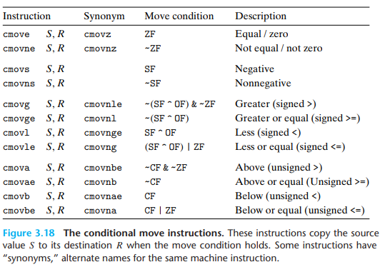
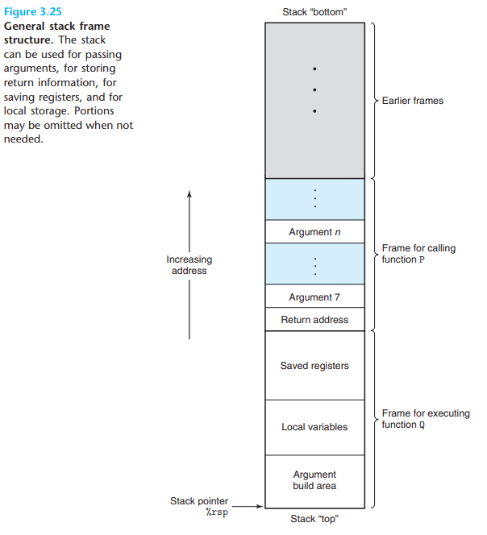
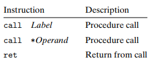

# Chapter 3 x86-64 Assembly

## 3.1 编译与反编译工具

> Two-page x86-64 GDB cheet sheet: [gdbnotes-x86-64](http://csapp.cs.cmu.edu/3e/docs/gdbnotes-x86-64.pdf)

> `gcc`编译文件
```bash
# 将C源文件编译至汇编级别
$ gcc -Og -S test.c
# -Og -O2 -O1 代表优化级别

# 编译至目标代码级别
$ gcc -c test.c
```
> 反汇编器
```bash
$ objdump -d bin    # disasmble bin
$ objdump -t bin    # symbol table of bin
```

## 3.2 x86-64 汇编语言(AT&T格式)

### 3.2.1 数据访问与信息格式

1. 三类访问对象：立即数、寄存器、储存器

2. 数据格式：  


3. 整数寄存器：


4. 指令格式：

> 注：  
> 1. 比例因子必须是1, 2, 4, 8
> 2. 基址和变址寄存器必须是64位寄存器

---

### 3.2.2 指令

#### 数据传送指令
> 大写代表一类运算，根据格式自动加上指令后缀  
> 小写代表特定运算

1. 等长数据传送：


> x86-64特点：
> 1. 传送指令的两个操作数不能都指向内存位置 
> 2. 任何为寄存器生成32位值的行为都会将寄存器高位置为0  
> 
> `movabsq`说明：  
> 处理立即数时:
> - `movq`只能以32为补码为源操作数，然后进行符号扩展，传送到目标位置；
> - `movabsq`可以以任意64位立即数作为源操作数，然后只能传送到寄存器。

2. 数据扩充传送：  

零扩充：


符号扩充：


3. 栈操作：


#### 算术运算指令：


> 1. `leaq`:加载有效地址，只能以寄存器为目标。  
> - 指针引用
> - 简单算术计算
> 2. `SAL`:移位，k只能是立即数或者`%cl`  
> **注**：x86-64中，移位操作对$w$位数据进行操作时，移位量由`%cl`的低$m$位决定，$2^m=w$（高位被忽略）。  
> 例如：当`%cl=0xFF`时，`salb`使数据移动7位，`salw`使数据移动15位，`sall`使数据移动31位

特别的算术运算：


#### 条件与跳转指令

1. 条件码设置与使用指令

> 符号寄存器`flag`：  
> `ZF`: zero flag 零标志位  
> `SF`: sign flag 符号标志位  
> `CF`: carry flag 进位标志位, 用于无符号数运算  
> `OF`: overflow flag 溢出标志位，用于有符号数运算

**设置条件码**：

- 除`leap`外, 图3.10中的所有运算指令都能改变条件码
    > `leap`不改变标志位  
    > 逻辑操作设置`CF`, `OF`为0  
    > 移位操作将`CF`设置为移出的最后一个bit
    > `dec, inc`设置`OF`, `ZF`, 但不改变`CF`

- 下面的指令改变条件码但不改变寄存器的值


**条件码的使用**：`set`指令
> `set`指令根据`flag`的状态设定单位字节`D`为1或0
> 练习题参看3-13,3-14


2. 跳转指令：

> 间接跳转：  
> `jmp *%rax`：以%rax中地址为目标跳转  
> `jmp *(%rax)`：以内存`(%rax)`中地址为目标跳转

> 相对寻址：  
> 计算相对地址时，基址为`jmp`指令下一条指令的地址


3. 条件传送指令：  


---

### 3.2.3 机器级程序结构

#### 一、控制（条件分支、循环、条件跳转的实现）

##### 条件分支

1. 条件控制的条件分支(`if`)  

```C
long absdiff(long x, long y)
{
	long result;
	if(x>y){
		result=x-y;
	}else{
		result=y-x;
	}
	return result;
}
```
将上述C程序进行`-Og`级别编译后得到汇编代码：
```x86asm
; long absdiff(long x, long y);
; x in %rdi, y in %rsi
absdiff:
	movq	%rdi, %rax
	cmpq	%rsi, %rdi
	jle	.L2
	subq	%rsi, %rax
	ret
.L2:
	subq	%rdi, %rsi
	movq	%rsi, %rax
	ret
```
条件分支的汇编流程使用`goto`风格的C表示为：
```C
    t=test-expr
    if(!t)
        goto false;
    then-expr;
    goto done;
false:
    else-expr;
done:
    ...;
```
2. 条件传送的条件分支：(对应C中的条件表达式)

> 流水线(pipelining):   
>  x86-64处理器通过流水线提高性能，CPU并发处理多条指令，因而可预测的指令序列是必须的。  
>  使用控制的跳转指令的指令序列是不可预测的，而使用数据的跳转指令的指令序列是可预测的。因此后者时间成本期望较低。

将上面的程序进行`-O1/2`级别的编译，得到汇编代码：
```x86asm
; long absdiff(long x, long y);
; x in %rdi, y in %rsi
absdiff:
	movq	%rdi, %rdx
	movq	%rsi, %rax  ;result=y
	subq	%rsi, %rdx  ;计算x-y
	subq	%rdi, %rax  ;计算y-x, result=y-x
	cmpq	%rsi, %rdi  ;比较x, y
	cmovg	%rdx, %rax  ;若x>y, result=x-y
	ret
```

从上面的例子可以看出, 使用条件传送的条件分支会计算每一个分支中的数据，然后根据条件进行返回。因此，对于：  
- 计算量大，时间期望成本高的情况
- 分支内计算会出现错误或者不期望出现的副作用  
即使进行`O1/2`级别的优化，汇编依旧会采用条件控制的分支。

- 例子1：（仅仅加上两个全局变量）
    ```C
    long le_cnt=0;
    long g_cnt=0;
    long absdiff(long x, long y)
    {
        long result;
        if(x>y){
            g_cnt=1;
            result=x-y;
        }else{
            le_cnt=1;
            result=y-x;
        }
        return result;
    }
    ```
    使用`O1/O2/Og`级别优化，生成的汇编代码都是一样的：
    ```x86asm
    ; long absdiff(long x, long y);
    ; x in %rdi, y in %rsi
    absdiff:
        movq	%rdi, %rax
        cmpq	%rsi, %rdi
        jle	.L2
        movq	$1, g_cnt(%rip)
        subq	%rsi, %rax
        ret
    .L2:
        movq	$1, le_cnt(%rip)
        subq	%rdi, %rsi
        movq	%rsi, %rax
        ret
    ```
- 例子2：（条件表达式）
    ```C
    long ptrvalue(long *xp)
    {
        return xp ? *xp : 0;
    }
    ```
    使用`O1/O2/Og`级别优化，生成的汇编代码都是一样的：
    ```x86asm
    ; long ptrvalue(long *xp)
    ; xp in %rdi
    ptrvalue:
        movl	$0, %eax
        testq	%rdi, %rdi
        je	.L1
        movq	(%rdi), %rax
    .L1:
        ret
    ```


##### 循环

1. `do-while`循环

循环模式：
```
do
    body-statement;
while (test-expr);
```
汇编等价的`goto`描述：
```C
loop:
    body-statement;
    t=test-expr;
    if(t)
        goto loop;
```

2. `while`循环

循环模式：
```
while(test-expr)
    body-statement;
```
汇编等价的`goto`描述：
```C
//1. jump to middle
goto test;
loop:
    body-statement;
test:
    t=test-expr;
    if(t)
        goto loop;

//2. guarded-do 
t=test-expr;
if(!t)
    goto done;
loop:
    body-statement;
    t=test-expr;
    if(t)
        goto loop;
done:
```

3. `for`循环

等价于`while`循环


##### `switch`与跳转表

- switch的实现：  
    将多个入口映射为一个代码块指针数组。
- 逆向工程：  
  - 确定映射关系
  - 找到`default`代码块
  - 一一对应

```C
void switcher(long a, long b, long c, long *dest)
{
    long val=0;
    switch(a){
        case 5:
            c=b^15;
        case 0:
            val=c+112;
            break;
        case 2:
        case 7:
            val=(a+b)*4; 
            break;
        case 4:
            val=a;
            break;
        default:
            val=b;
    }
    *dest=val;
}
```

`gcc`编译至汇编级别：
```x86asm
switcher:
	cmpq	$7, %rdi
	ja	.L6
	leaq	.L4(%rip), %r8
	movslq	(%r8,%rdi,4), %rax
	addq	%r8, %rax
	notrack jmp	*%rax
	.section	.rodata
	.align 4
	.align 4
.L4:
	.long	.L7-.L4
	.long	.L6-.L4
	.long	.L3-.L4
	.long	.L6-.L4
	.long	.L8-.L4
	.long	.L5-.L4
	.long	.L6-.L4
	.long	.L3-.L4
	.text
.L5:
	movq	%rsi, %rdx
	xorq	$15, %rdx
.L7:
	leaq	112(%rdx), %rsi
.L6:
	movq	%rsi, (%rcx)
	ret
.L3:
	addq	%rdi, %rsi
	salq	$2, %rsi
	jmp	.L6
.L8:
	movq	%rdi, %rsi
	jmp	.L6
```

#### 二、过程

> 过程：一个子例程，谓之过程。如C中的函数，python中的方法。  
> 过程的调用包括3个重要动作：
> - 传递控制。即将%rip压栈
> - 传递数据。即通过寄存器和堆栈传递参数
> - 分配和释放内存。即给局部变量分配和释放栈上的内存

**调用模型**:  


1. 传递控制：

与16位汇编不同，x86-64的地址转移时只需要将%rip压栈



2. 传递参数：  

- 调用参数首选用寄存器传送，当参数大于6个，使用栈帧传送。
  - 传送用寄存器：`%rdi, %rsi, %rdx, %rcx, %r8, %r9`(视参数大小使用寄存器的部分)
  - 栈帧传送参数：从最后一个参数依次入栈。

- 调用时使用寄存器
  - 被调用者保存寄存器：`%rbx, %rbp, %r12~%r15`  
  	调用时子程序需要保存这部分寄存器中的值，子程序不可随意使用这些寄存器。
  - 调用者保存寄存器：除`%rsp`以及上述寄存器外的寄存器(`%rax, %rdx, %rcx, %rdi, %rsi, %r8~%11`)  
  	调用时父程序若有需要应先保存这部分寄存器中的值，这部分寄存器可以随意使用。

3. 分配和释放内存：  
    调整`%sp`的值，发生于
    - 寄存器不足以储存变量
    - 对变量进行了取地址`&`操作
    - 变量是数组和结构变量

---

### 3.2.4 数组与异质数据结构

#### 数组

1. 访问数组元素  

| 数组类型 | 访问公式 |
|----------|----------|
| `T A[N]` | $\&A[i]=A+L\cdot i$ |
| `T A[N][M]` | $\&A[i][j]=A+L\cdot(i\cdot M +j)$ |
> 注：L为元素长度

例子：访问二维数组元素
```C
# define N 16
long fix_ele(long a[N][N], long i, long j)
{
	return a[i][j];
}
```
对应汇编代码：
```x86asm
; long fix_ele(long a[N][N], long i, long j)
; a in %rdi, i in %rsi, j in %rdx
fix_ele:
	salq	$7, %rsi            ; %rsi: L*M*i
	addq	%rsi, %rdi          ; %rdi: a+L*M*i
	movq	(%rdi,%rdx,8), %rax ; %rax: (a+L*M*i+L*j)
	ret
```

2. 定长数组(fixed array)与可变数组(varible array)

可变数组访问数组元素：
```C
long fix_ele(long n, long a[n][n], long i, long j)
{
	return a[i][j];
}
```
对应汇编代码：
```x86asm
; long fix_ele(long n, long a[n][n], long i, long j)
; n in %rdi, a in %rsi, i in %rdx, j in %rcx
fix_ele:
	imulq	%rdi, %rdx
	leaq	(%rsi,%rdx,8), %rax
	movq	(%rax,%rcx,8), %rax
	ret
```
两者的区别：
- 定长数组可使用`sal`指令计算地址
- 可变数组使用`imul`指令计算地址，且需要一个位置存放`n`

#### 异质数据结构(结构，联合)

>  对齐原则：  
> 任何`K`字节的基本对象的基址必须是`K`的整数倍  


- 结构元素中可能出现空隙，以满足结构的对齐要求  
- 结构末尾也可能出现空隙，以满足结构数组的对齐要求  


例如：
```C
struct type{
	int i;
	char ch;
	int j;
};
type S;
```
> `S`的数据长度不是9而是12

更改结构中变量顺序可以节省空间：
```C
struct type{
	int i;
	int j;
	char ch;
};
type S[2];
```
> 此时S[1]的长度是9，S的长度是21


## 3.3 栈溢出

三种防止栈溢出的方式：  
1. 写安全的代码:laughing:
2. 栈随机化
3. 栈不可执行
4. 哨兵(canary)