# Chapter 3 x86-64 Assembly

## 3.1 编译与反编译工具
> `gcc`编译文件
```bash
# 将C源文件编译至汇编级别
$ gcc -Og -S test.c
# -Og -O2 -O1 代表优化级别

# 编译至目标代码级别
$ gcc -c test.c
```
> 反汇编器
```bash
$ objdump -d bin
```

## 3.2 x86-64 汇编语言(AT&T格式)

### 3.2.1 数据访问与信息格式

1. 三类访问对象：立即数、寄存器、储存器
2. 数据格式：  
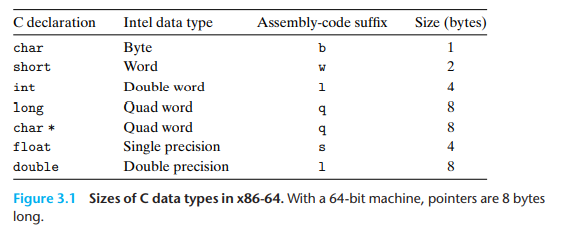
3. 整数寄存器：
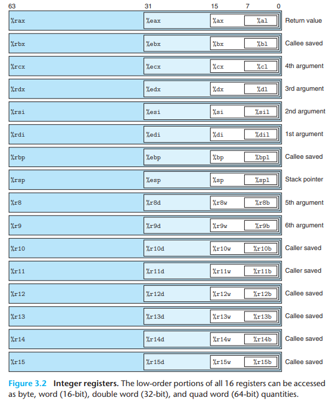
4. 指令格式：
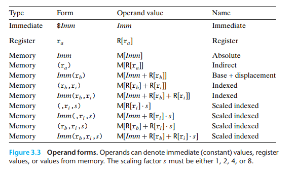
> 注：比例因子必须是1, 2, 4, 8

### 3.2.2 指令

#### **数据传送指令**
> 大写代表一类运算，根据格式自动加上指令后缀  
> 小写代表特定运算

1. 等长数据传送：

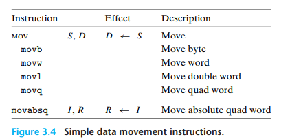

> x86-64特点：
> 1. 传送指令的两个操作数不能都指向内存位置 
> 2. 任何为寄存器生成32位值的行为都会将寄存器高位置为0  
> 
> `movabsq`说明：  
> 处理立即数时:
> - `movq`只能以32为补码为源操作数，然后进行符号扩展，传送到目标位置；
> - `movabsq`可以以任意64位立即数作为源操作数，然后只能传送到寄存器。

2. 数据扩充传送：  

零扩充：
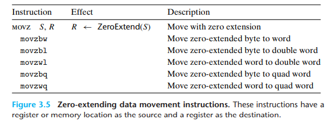

符号扩充：
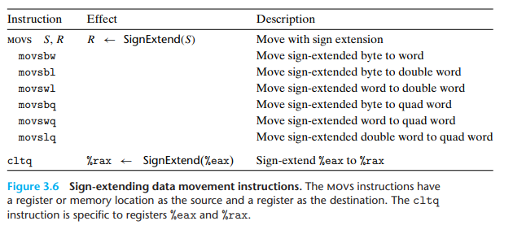

3. 栈操作：

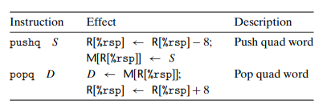

4. 算术运算：

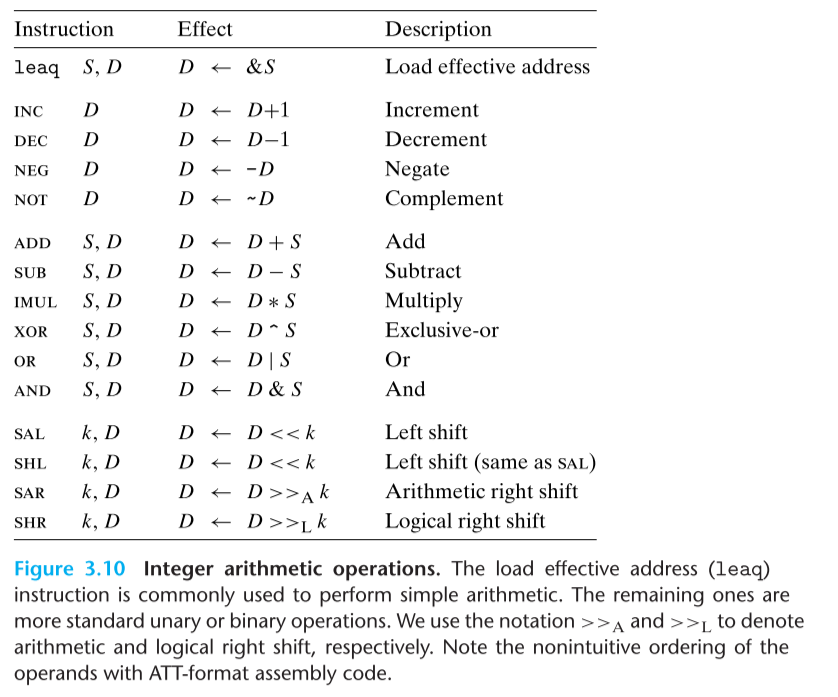

> 1. `leaq`:加载有效地址，只能以寄存器为目标。  
> - 指针引用
> - 简单算术计算
> 2. `SAL`:移位，k只能是立即数或者`%cl`  
> **注**：x86-64中，移位操作对$w$位数据进行操作时，移位量由`%cl`的低$m$位决定，$2^m=w$（高位被忽略）。  
> 例如：当`%cl=0xFF`时，`salb`使数据移动7位，`salw`使数据移动15位，`sall`使数据移动31位

特别的算术运算：

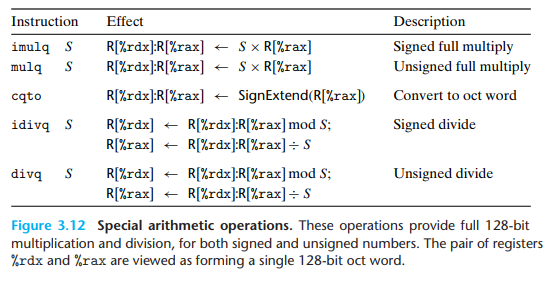

#### **条件与跳转指令**

1. 条件码设置与使用指令

> 符号寄存器`flag`：  
> `ZF`: zero flag 零标志位  
> `SF`: sign flag 符号标志位  
> `CF`: carry flag 进位标志位, 用于无符号数运算  
> `OF`: overflow flag 溢出标志位，用于有符号数运算

*设置条件码*：

> `leap`不改变标志位  
> 逻辑操作设置`CF`, `OF`为0  
> `dec, inc`设置`OF`, `ZF`, 但不改变`CF`

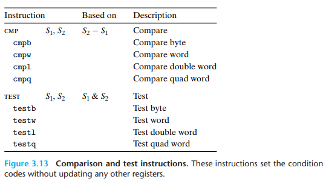


*条件码的使用：set指令*
> `set`指令根据`flag`的状态设定单位字节`D`为1或0
> 练习题参看3-13,3-14

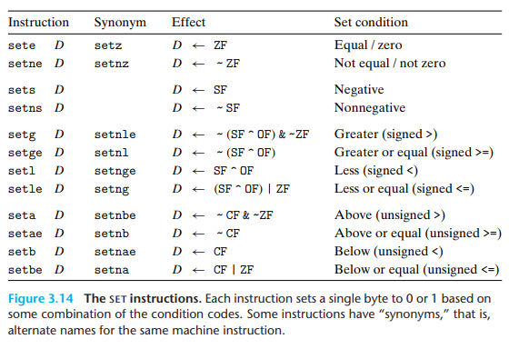

2. 跳转指令：

> 间接跳转：  
> `jmp *%rax`：以%rax中地址为目标跳转  
> `jmp *(%rax)`：以内存`(%rax)`中地址为目标跳转

> 相对寻址：  
> 计算相对地址时，基址为`jmp`指令下一条指令的地址

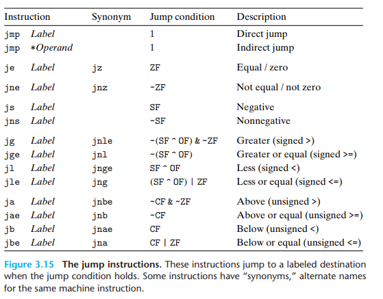


### 3.2.3 机器级程序

#### 控制（条件分支、循环、条件跳转的实现）

1. 条件分支(`if`)  

将如下C程序进行`-Og`编译后得到汇编代码：
```C
long absdiff(long x, long y)
{
	long result;
	if(x>y){
		result=x-y;
	}else{
		result=y-x;
	}
	return result;
}
```
```x86asm
; long absdiff(long x, long y);
; x in %rdi, y in %rsi
absdiff:
	endbr64
	movq	%rdi, %rax
	cmpq	%rsi, %rdi
	jle	.L2
	subq	%rsi, %rax
	ret
.L2:
	subq	%rdi, %rsi
	movq	%rsi, %rax
	ret
```
条件分支的汇编流程使用`goto`风格的C表示为：
```C
    t=test-expr
    if(!t)
        goto false;
    then-expr;
    goto done;
false:
    else-expr;
done:
    ...;
```