# Chapter 4 处理器体系结构

> ISA(Instruction-Set Architecture): 处理器支持的指令以及指令字节编码

## 4.1 Y86-64指令集体系结构

> 一个指令集体系结构包括：
> 1. 状态单元
> 2. 指令集及其编码
> 3. 编程规范
> 4. 异常处理

### 4.1.1 状态单元

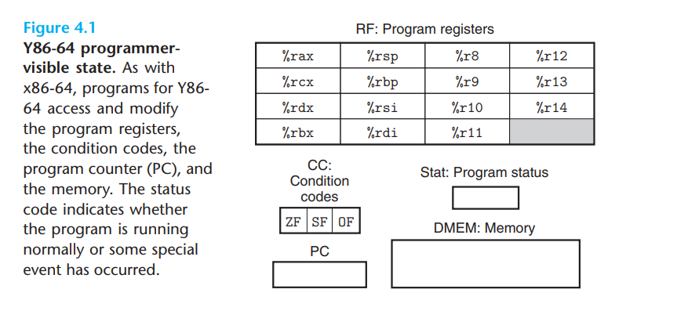
1. `RF`: 程序寄存器。各个寄存器的使用与x86基本一样，为了简化省略了`%r15`
2. `CC`: 条件码。Y86仅有3位：`ZF, SF, OF`
3. `PC`: 程序计数器。存放当前正在执行指令的地址。
4. `stat`: 状态码。指示程序运行是否出现异常。
5. `DMEM`: 主存。

### 4.1.2 指令集及其编码

1. 指令集编码
    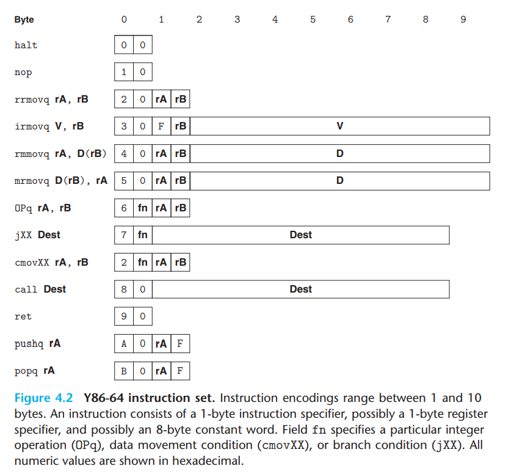
    Y86指令集基本是x86指令集的子集，仅支持:
    - 8字节整数的操作
    - 基址-偏移寻址
    - 运算指令仅能对寄存器进行操作
    - `halt`指令使处理器停止运行，并设置`stat`为`HLT`

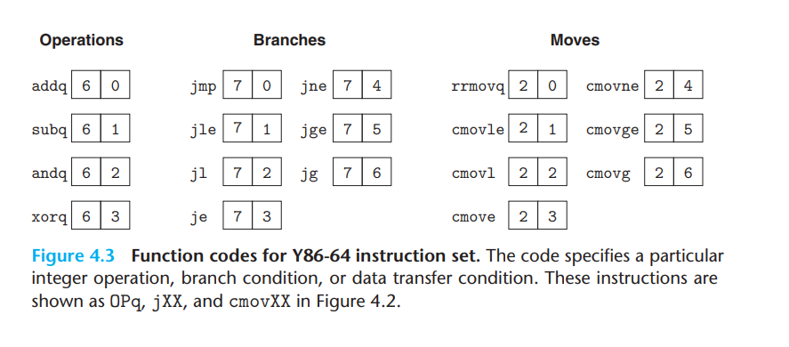

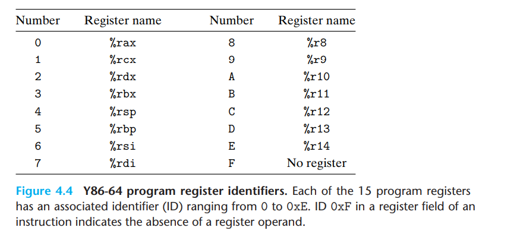
> 程序寄存器存在于CPU中的一个寄存器文件中，寄存器文件是一个RAM

2. Y86-64中指令的约定

对于`pushq, popq`指令来说，分别有一个指令行为是不确定的：
```x86asm
pushq   %rsp
popq    %rsp
```
通过小实验[`pushtest`](./../../csapplab/archlab/sim/misc/pushtest.ys)
[`poptest`](./../../csapplab/archlab/sim/misc/poptest.ys)确定：
- `pushq %rsp`将`%rsp`压入堆栈而不是`%rsp-8`
- `popq %rsp`将`(%rsp)`的值赋给`%rsp`而不是`%rsp+8`


### 4.1.3 异常

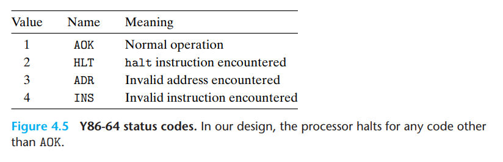

> 在更完整的设计中，CPU会中断调用异常处理程序(exception handler)

## 4.2 逻辑设计与硬件控制语言HCL

### 4.2.1 逻辑门

基本逻辑门：与或非门
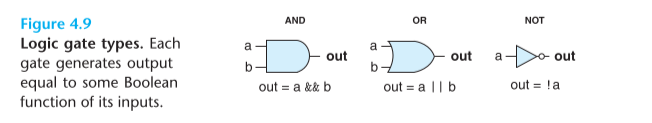
HCL语言表达:
```C
bool out1= a && b;
bool out2= a || b;
bool out= !a;
```

### 4.2.2 bit级组合电路

组合电路的限制：
- 每个逻辑门的输入必须是以下之一：
    - 系统输入
    - 储存器单元的输出
    - 逻辑门的输出
- 逻辑门的输出不能连接在一起
- 组合电路无环

1. 同或组合电路
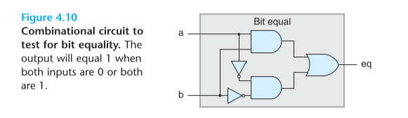
```C
bool eq = (a && b) || (!a && !b)
```
与之对应的异或
```C
bool xor = (a && !b) || (!a && b)
```

2. 多路复用器(multiplexor)
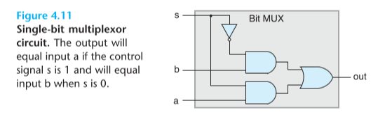
```C
out = (s && a) || (!s && b)
```

### 4.2.3 word级组合电路

1. 同或组合电路
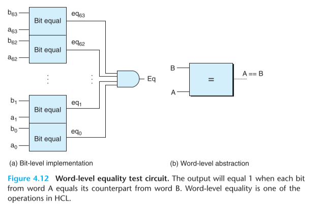
```C
bool eq = A==B
```

2. 多路复用器(multiplexor)


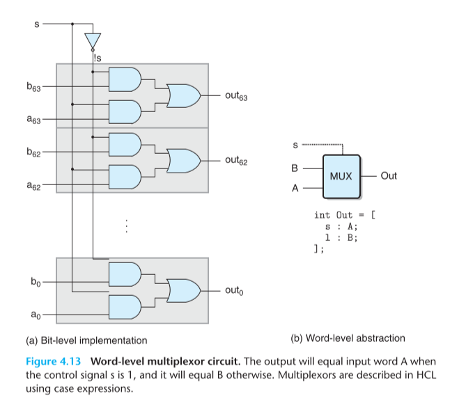
与位级组合电路不同，字级组合电路根据输入控制位s产生字级的数据，其HCL语言如下表达：
```C
word out = [
    s : A;
    1 : B;
];
```

3. 其他组合电路

- 无控制信号的组合电路
    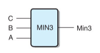
    ```C
    word Min3 = [
        A <= B && A<= C : A;
        B <= C          : B;
        1               : C;
    ]
    ```

- 多控制信号的组合电路
    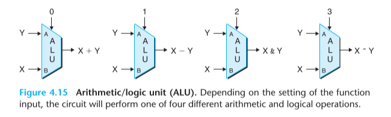
    计算单元内部有一个四路复用器, 根据两个控制信号`s1, s0`来选择输出：  
    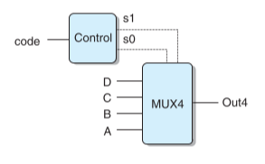

    控制信号的生成和四路复用器HCL表述如下:
    ```C
    bool s1 = code in {2, 3}
    bool s0 = code in {1, 3}
    /*等价于
    bool s1 = code == 2 || code ==3
    bool s0 = code ==1 || code ==3
     */
    Out4 = {
       !s1 && !s0   : A; // 00
       !s1          : B; // 01
       !s0          : C; // 10 
       1            : D; // 11 
    }
    ```

### 4.2.4 时钟和储存器

> - 时钟寄存器（简称寄存器)存储单个位或字。时钟信号控制寄存器加载输入值。时钟周期信号上升沿改变寄存器输入。

> - 随机访问存储器（简称内存）存储多个字，用地址来选择该读或该写哪个字。包括：
>   - 虚拟内存系统
>   - 寄存器文件

Y86-64中储存器结构如下
1. RF  
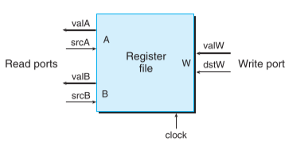

2. DMEM  
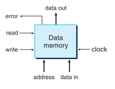


## 4.3 Y86-64的顺序实现

### 4.3.1 指令分段
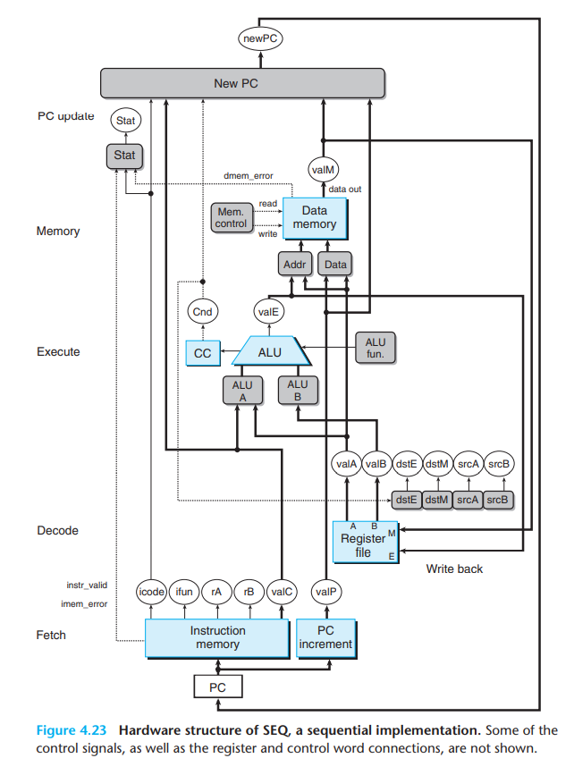
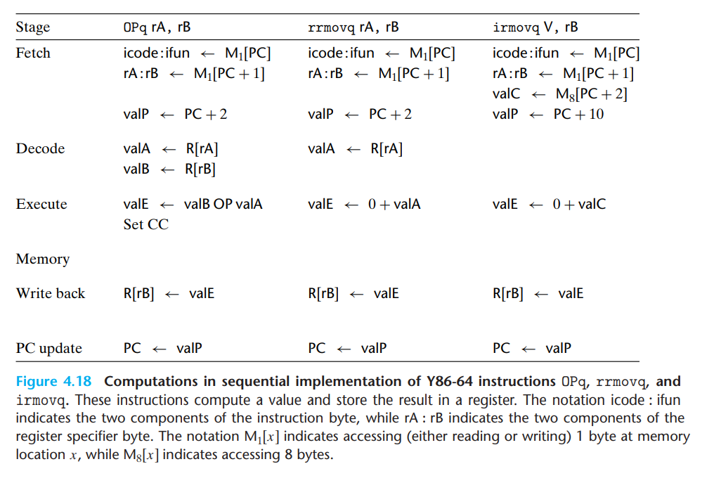
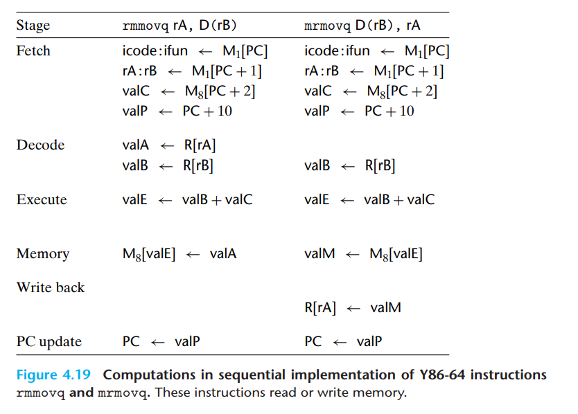
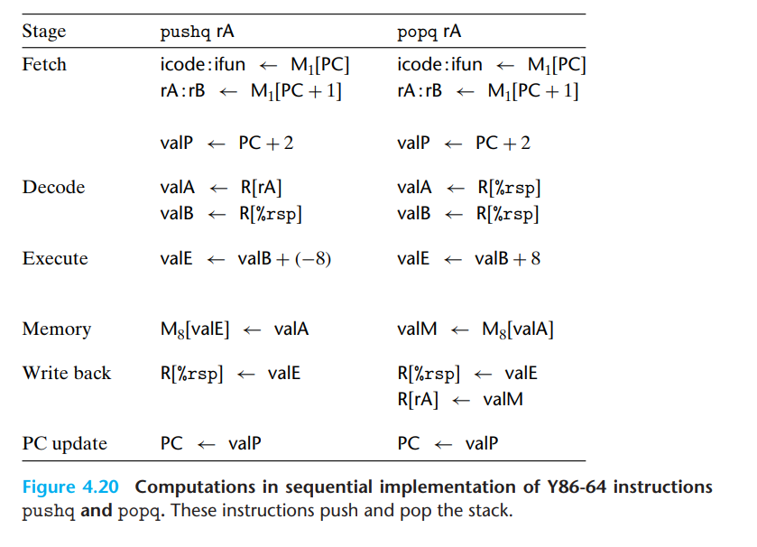
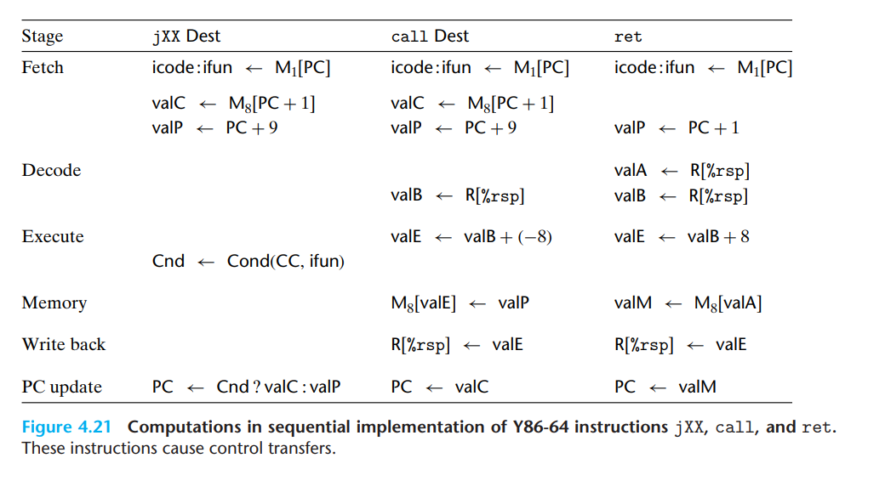
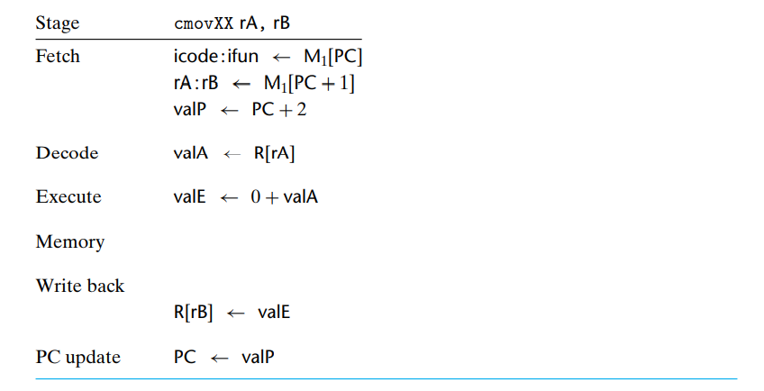

### 4.3.2 各阶段的逻辑实现

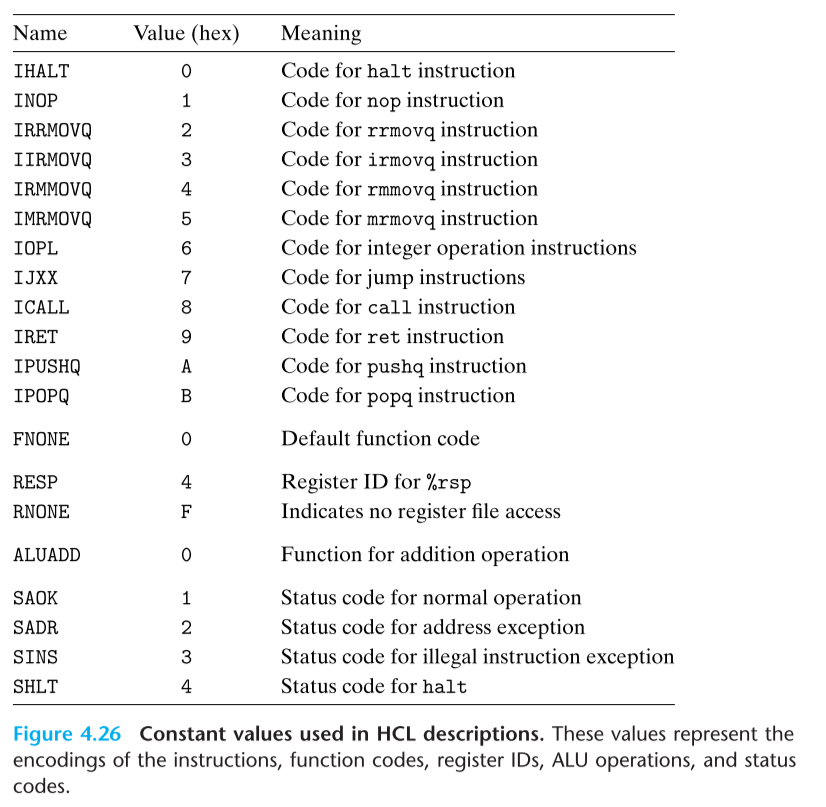

1. 取指
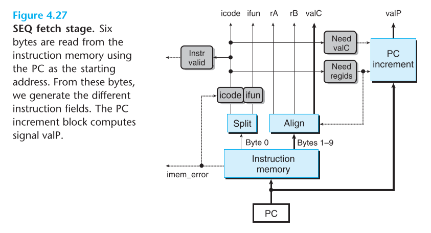

2. 译码和写回
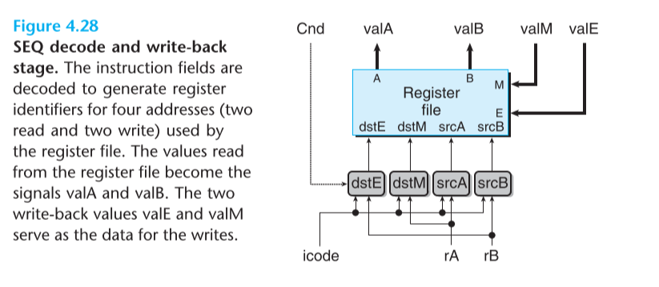

3. 执行
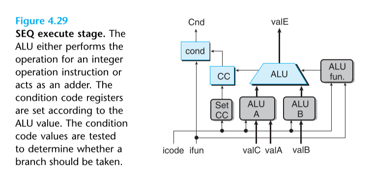

4. 访存
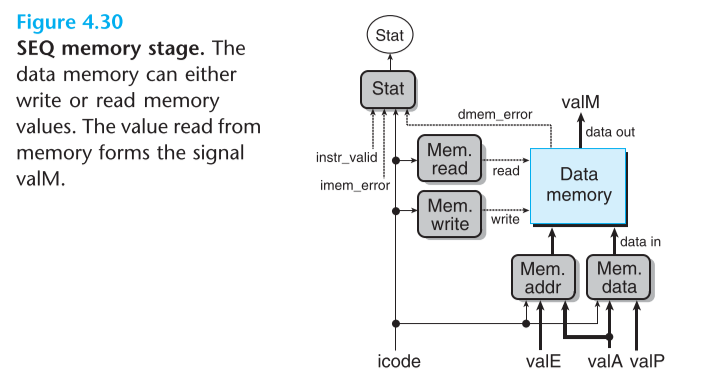

5. 更新PC
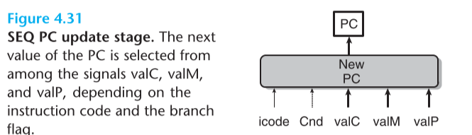